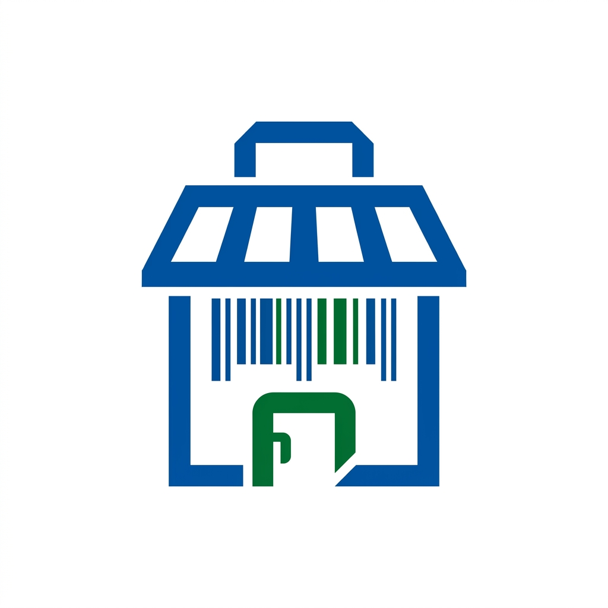

<p align="center">
  
</p>

<h1 align="center">Mhenching Store System</h1>

<p align="center">
  <strong>A full-stack, serverless Point-of-Sale and store management platform for retail and restobar operations</strong>
</p>

<p align="center">
  
  
  
  
  
  
</p>

---

## Overview

Mhenching Store System is a **serverless, cross-platform POS and store management application** built for a real convenience store and restobar in the Philippines. It handles everything from barcode scanning and checkout to running restaurant table bills, accounts receivable ("utang") tracking, and end-of-day profit analytics — all from a single codebase that deploys as a web dashboard and native Android APKs.

The system is designed around three operational roles:

| Role | Interface | Purpose |
|------|-----------|---------|
| **Store Attendant** | Mobile POS (Android APK / Web) | Scan barcodes, build carts, process checkout with multiple payment methods |
| **Restobar Attendant** | Mobile POS — Table Bill Mode | Open running tabs for tables/groups, add items across rounds, settle on request |
| **Store Manager** | Web Admin Dashboard + Mobile Capture | Manage inventory, view live sales, run EOD reports, void transactions, track receivables |

---

## Key Features

### 📱 Mobile Point-of-Sale
- **Real-time barcode scanning** using the device back camera via `html5-qrcode`
- **Attendant authentication** — staff log in daily with assigned email/password credentials
- **Quick Sale mode** for immediate retail checkout
- **Table Bill mode** for restobar operations with multi-round ordering
- **Multiple payment methods** — Cash, GCash, Maya QR, Card Terminal, USDT, and Utang (credit)
- **Cart management** with manager-PIN-protected item removal
- **Live cart sync** — active carts are visible to management in real time before checkout

### 🖥️ Web Admin Dashboard
- **Product Management** — full CRUD with SKU/barcode, cost, markup, retail price, stock, pack multiplier, and product photos
- **Live Sales Today** — real-time view of all transactions (open + closed) before End-of-Day
- **EOD Summary** — closed-only profit report with gross revenue, historical COGS, and net profit
- **Sales Reports** — daily, weekly, and monthly historical aggregates with date selection
- **Top 10 Analytics** — best sellers, stockout risk, fast-moving replenishment plan with estimated capital
- **Utang Ledger** — overdue, due-today, upcoming, and paid credit tracking
- **Running Bills** — live view of open restobar table bills with bill aging
- **Live POS Monitor** — real-time attendant cart visibility with item-level detail
- **Manager Void Controls** — PIN-protected void RPCs for bill items, whole bills, and completed transactions
- **Report Exports** — Print/PDF, CSV (for Sheets/Excel), plain-text advisor brief, clipboard copy

### 📸 Mobile Admin Capture
- **Phone-based inventory entry** — scan product barcodes and capture item photos using the device camera
- **Auto-detect existing products** — scanned barcodes load existing records for editing instead of creating duplicates
- **Inventory intelligence fields** — received date, expiry date, batch number, perishable flag, reorder point
- **Direct upload** to Supabase Storage with product image path saved to the database

### 🍽️ Restobar Running Bills
- **Table, group, and customer tab billing** with multi-round item additions
- **Bill lifecycle** — `open` → `bill_requested` → `paid` / `voided`
- **Stock-aware** — confirmed items decrement inventory immediately; voids restore stock
- **Settlement creates transaction records** so paid bills appear in the same EOD/profit reports as POS sales

### 💳 Payments & Accounts Receivable
- **Six payment methods** — Cash, GCash, Maya QR, Card Terminal, USDT Manual, Utang Ledger
- **Accounts receivable tracking** — customer name, contact, amount owed, balance, due date, and status
- **Utang Ledger dashboard** — overdue alerts, due-today reminders, and payment history

### 📊 Business Analytics & AI Advisor Briefs
- **Deterministic reports** from real sales data — no AI dependency required
- **Structured advisor brief** exportable as text for paste into Gemini, ChatGPT, or any AI advisor
- **Fast-moving replenishment plan** — suggested buy quantities and estimated capital for restocking
- **Expiry and stockout risk** flags based on inventory intelligence fields

---

## Architecture

```
┌─────────────────────────────────────────────────────────┐
│                    Client Layer                         │
│                                                         │
│  ┌─────────────┐  ┌──────────────┐  ┌───────────────┐  │
│  │ Mobile POS  │  │ Web Admin    │  │ Admin Capture │  │
│  │ (Android)   │  │ Dashboard    │  │ (Phone)       │  │
│  │ /           │  │ /admin       │  │ /admin/capture│  │
│  └──────┬──────┘  └──────┬───────┘  └───────┬───────┘  │
│         │                │                   │          │
│         └────────────────┼───────────────────┘          │
│                          │                              │
│              Next.js 14 Static Export                   │
│              Capacitor 8 (Android Shell)                │
└──────────────────────────┬──────────────────────────────┘
                           │ HTTPS + Realtime WebSocket
                           ▼
┌──────────────────────────────────────────────────────────┐
│                  Supabase (Backend)                       │
│                                                          │
│  ┌────────────┐  ┌──────────┐  ┌───────────────────────┐│
│  │ PostgreSQL │  │ Realtime │  │ Storage               ││
│  │            │  │ Engine   │  │ (product-images)      ││
│  │ • products │  │          │  │                       ││
│  │ • trans.   │  │ Live     │  └───────────────────────┘│
│  │ • bills    │  │ sync to  │                            │
│  │ • AR/utang │  │ all      │  ┌───────────────────────┐│
│  │ • carts    │  │ clients  │  │ Server-side RPCs      ││
│  │ • orders   │  │          │  │ • process_checkout    ││
│  └────────────┘  └──────────┘  │ • bill management     ││
│                                │ • void controls        ││
│                                └───────────────────────┘│
└──────────────────────────────────────────────────────────┘
```

**Key architectural decisions:**

- **100% serverless** — no Node.js backend; all business logic runs as PostgreSQL RPCs in Supabase
- **Static export** — `next build` produces a static site that Capacitor wraps into native Android APKs
- **Real-time sync** — Supabase Realtime pushes product/price changes to all connected devices instantly
- **Atomic checkout** — the `process_checkout_with_payment` RPC validates inventory and calculates totals server-side, preventing client manipulation
- **Historical COGS** — `unit_cost_at_sale` is captured at transaction time so profit reports remain accurate even after price changes

---

## Tech Stack

| Layer | Technology | Purpose |
|-------|-----------|---------|
| **Frontend** | Next.js 14, React 18, TypeScript 5 | UI framework with static export |
| **Styling** | Tailwind CSS 3.4, `clsx`, `tailwind-merge` | Utility-first responsive design |
| **Icons** | Lucide React | Consistent icon system |
| **Barcode Scanning** | `html5-qrcode` | Real-time camera-based barcode detection |
| **Data Fetching** | `swr` | Stale-while-revalidate caching with Supabase |
| **Database** | Supabase (PostgreSQL 15) | Managed database with Realtime, Storage, and RPC |
| **Mobile** | Capacitor 8 | Web → Android native bridge |
| **Build** | Gradle (Android), Next.js CLI | Debug and release APK generation |

---

## Database Schema

The system uses **12 tables** and **6 custom enum types** across 5 SQL migration files (~1,620 lines of SQL):

| Table | Purpose |
|-------|---------|
| `products` | Inventory with cost, markup, stock, barcode, photos, expiry, batch tracking |
| `transactions` | Completed sales with payment method, attendant, and device tracking |
| `transaction_items` | Line items with `unit_cost_at_sale` for historical COGS |
| `bill_sessions` | Restobar running bills — tables, groups, and customer tabs |
| `bill_items` | Individual items within a running bill session |
| `accounts_receivable` | Utang (credit) ledger with balance, due date, and status tracking |
| `orders` | Omnichannel order schema for POS, web, and social channels |
| `order_items` | Line items within an omnichannel order |
| `pos_cart_sessions` | Live attendant cart monitoring (pre-checkout) |
| `pos_cart_items` | Items within an active POS cart |

**Server-side RPCs:** `process_checkout`, `process_checkout_with_payment`, `open_bill`, `add_bill_item`, `request_bill`, `settle_bill`, `void_bill_item`, `void_bill`, `void_transaction`

---

## Project Structure

```
mhenching-store-system/
├── src/
│   ├── app/
│   │   ├── page.tsx                 # Mobile POS — attendant checkout (1,144 lines)
│   │   ├── admin/
│   │   │   ├── page.tsx             # Web Admin Dashboard (4,294 lines)
│   │   │   └── capture/
│   │   │       └── page.tsx         # Mobile Admin Capture (1,071 lines)
│   │   ├── layout.tsx               # Root layout with metadata
│   │   └── globals.css              # Global styles
│   ├── components/
│   │   ├── Scanner.tsx              # Back-camera barcode scanner
│   │   ├── Cart.tsx                 # Shopping cart with totals
│   │   ├── ProductSearch.tsx        # Product lookup by name/barcode
│   │   ├── QuantityModal.tsx        # Quantity input dialog
│   │   └── Logo.tsx                 # Brand logo component
│   ├── lib/
│   │   ├── supabase.ts              # Supabase client singleton
│   │   ├── access.ts                # Attendant auth & manager PIN logic
│   │   ├── payments.ts              # Payment method types and helpers
│   │   └── productImages.ts         # Storage bucket helpers
│   └── types/
│       └── index.ts                 # Shared domain types
├── database_schema.sql              # Full schema (run on fresh Supabase)
├── database_integrated_upgrade.sql  # Upgrade: payments, AR, omnichannel
├── database_restobar_billing_update.sql  # Upgrade: bill RPCs
├── database_pos_live_void_update.sql     # Upgrade: live carts, void RPCs
├── database_product_photos_update.sql    # Upgrade: storage bucket + policies
├── capacitor.config.ts              # Capacitor Android configuration
├── MILESTONES.md                    # Development roadmap and checklist
├── ANDROID_BUILD.md                 # APK build instructions
├── SUPABASE_SETUP.md                # Database setup guide
├── mhenching_inventory_template.csv # Sample inventory import template
└── package.json                     # Dependencies and scripts
```

**Source metrics:** ~6,800 lines of TypeScript/React + ~1,620 lines of SQL

---

## Getting Started

### Prerequisites

- [Node.js](https://nodejs.org/) 18+ and npm
- A [Supabase](https://supabase.com/) project (free tier works for development)
- *(Optional)* JDK 21 and Android SDK for APK builds

### 1. Clone and Install

```bash
git clone https://github.com/michaelfutol/mhenching-store-system.git
cd mhenching-store-system
npm install
```

### 2. Set Up Supabase

1. Create a new project at [supabase.com](https://supabase.com)
2. Open the **SQL Editor** in your Supabase dashboard
3. Paste and run the contents of `database_schema.sql`

> For detailed setup including upgrade paths for existing projects, see [SUPABASE_SETUP.md](SUPABASE_SETUP.md).

### 3. Configure Environment

Copy the example environment file and fill in your Supabase credentials:

```bash
cp .env.local.example .env.local
```

Edit `.env.local`:

```env
NEXT_PUBLIC_SUPABASE_URL=https://your-project-id.supabase.co
NEXT_PUBLIC_SUPABASE_ANON_KEY=your-anon-key
NEXT_PUBLIC_ATTENDANT_ACCOUNTS=Staff 1|staff1@store.local|pass1;Staff 2|staff2@store.local|pass2
NEXT_PUBLIC_MANAGER_PIN=1234
```

### 4. Run Development Server

```bash
npm run dev
```

| URL | Interface |
|-----|-----------|
| `http://localhost:3000` | Mobile POS (attendant checkout) |
| `http://localhost:3000/admin` | Web Admin Dashboard (manager PIN required) |
| `http://localhost:3000/admin/capture` | Mobile Admin Capture (barcode + photo) |

### 5. Build for Android *(Optional)*

```bash
npm run build                    # Static export to out/
npx cap sync android             # Sync web assets to Android project
cd android
./gradlew assembleDebug          # Build debug APK
```

> For detailed APK build instructions including separate POS/Admin APK variants, see [ANDROID_BUILD.md](ANDROID_BUILD.md).

---

## Development Roadmap

The project follows a structured milestone system documented in [MILESTONES.md](MILESTONES.md). Current status:

| Milestone | Status | Description |
|-----------|--------|-------------|
| 0 — Baseline & Repo | ✅ Done | Repository, tooling, and Supabase connection |
| 1 — Backend Data Contract | ✅ Done | Products, transactions, checkout RPC, Realtime |
| 2 — Web Admin Dashboard | ✅ Done | Product management, EOD reports, live sales |
| 2A — Live Sales Visibility | ✅ Done | Same-day transaction visibility before Close Day |
| 2B — Inventory Intelligence | 🟡 Partial | Expiry, batch, perishable fields added; lot tracking planned |
| 2C — Analytics Reports | 🟡 Partial | Top 10 cards, historical reports done; full report suite planned |
| 2D — AI Advisor Brief | ✅ Done | Copy/PDF/CSV export of structured EOD reports |
| 3 — Mobile Admin Capture | ✅ Done | Camera barcode scan + product photo upload |
| 4 — Mobile POS | ✅ Done | Attendant login, scanning, checkout, cart sync |
| 5 — APK Shipping | 🟡 Partial | Debug APKs built; on-device validation in progress |
| 7 — Restobar Bills | ✅ Done | Running bills with void controls and settlement |
| 8 — Payments & AR | 🟡 Partial | Payment methods and basic utang ledger done |
| 8A — Live POS & Voids | ✅ Done | Cart monitoring and manager void RPCs |
| 9–11 — Future | ⬜ Planned | Online ordering, social channels, production hardening |

---

## Scripts

| Command | Description |
|---------|-------------|
| `npm run dev` | Start development server on `0.0.0.0:3000` |
| `npm run build` | Production static export to `out/` |
| `npm run lint` | Run ESLint checks |
| `npm start` | Start production server (SSR mode) |

---

## Contributing

This is currently a private project for a specific store operation. The codebase is structured for a single-tenant deployment with Supabase as the shared backend.

For questions about the architecture or implementation, please open an issue.

---

## License

Private — All rights reserved.

---

<p align="center">
  <sub>Built with Next.js, Supabase, and Capacitor — a complete serverless store system.</sub>
</p>
